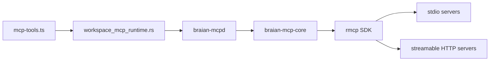

# Connections (MCP)

Braian uses the **Model Context Protocol (MCP)** shape for **workspace connections**: small programs or HTTP endpoints that *could* extend what an assistant can do (extra tools, resources, prompts). In the app UI this feature is labeled **Connections** so it stays approachable; the on-disk format matches what **Cursor** uses for MCP servers.

## Where configuration lives

- **File:** `.braian/mcp.json` inside the **active workspace** folder (created when you add a connection or when the app seeds `.braian`).
- **Shape:** A top-level **`mcpServers`** object. Each **key** is a server name (for example `github`, `p360-rest`); each **value** is the JSON object for that server—the same object you would put under `mcpServers` in Cursor.

### Stdio servers (local CLI)

The process is started with **`command`** and optional **`args`**, **`env`**, and optional **`cwd`** (relative to the workspace root; must stay inside the workspace).

### Remote servers (HTTP)

The entry uses **`url`** and optional **`headers`** instead of `command` / `args`. This matches Cursor-style remote MCP configuration.

### Braian-only: on/off without editing Cursor JSON

Cursor’s usual file does not define a standard **disabled** flag per server. Braian keeps each server’s entry identical to what you would copy into Cursor, and stores **off** state separately:

```json
{
  "mcpServers": { "my-server": { "command": "npx", "args": ["-y", "…"] } },
  "braian": {
    "disabledMcpServers": ["my-server"]
  }
}
```

A server is **on** in Braian when its name is **not** listed in `braian.disabledMcpServers`. The **Connections** screen **Copy for Cursor** action copies only `{ "mcpServers": … }` so you can paste into Cursor without the Braian overlay.

Braian also supports an optional workspace default for new chats:

```json
{
  "braian": {
    "defaultActiveMcpServers": ["atlassian", "azure-devops"]
  }
}
```

This does not force a server globally on; it seeds the per-chat selection for newly created conversations.

## Status indicators (green / red)

The **Connections** list can **check** each configured server:

- **Stdio:** The desktop app starts the server and negotiates MCP via the official Rust SDK (`rmcp`) over stdin/stdout, then lists tools. A **green** status means handshake + `tools/list` succeeded; the subtitle shows the discovered **tool count**. Expand **Show tool names** to inspect names. A **red** status means spawn, protocol, or timeout failure; use **Error — Show output** for details.
- **Remote:** The app connects with MCP Streamable HTTP through `rmcp`, sends configured **headers**, and maintains server session IDs as needed. **Green** means initialize + `tools/list` worked. **Red** means transport/protocol failure—open **Error — Show output** for the exact message.

**Check status** refreshes all probes. Probes also run when the workspace connection list changes.

## In chat (assistant tools)

When a server is **on** in Braian (not in `braian.disabledMcpServers`), it is **eligible** for chat use. Actual MCP tool availability is now **per chat** (desktop app only):

- Each chat can toggle active Connections from the chat header (**Connections** button).
- Only that chat's active server subset is listed and attached as model tools.
- If no servers are active for a chat, MCP is skipped for that turn.
- Tool names are namespaced as `mcp__<server>__<tool>` (safe slugged identifiers).

- Each turn, the app calls **`tools/list`** only for active servers (stdio and remote) and builds TanStack tools. MCP sessions stay warm across turns for faster follow-ups, then disconnect after an idle window (default **90 seconds**).
- If one server fails listing, other servers still work; you may see a short warning in the turn’s settings warnings.
- **Remote** servers use the same JSON-RPC POST session as the status check; very custom gateways may need a URL that speaks MCP over HTTP as above.

Under the hood, Braian runs MCP through a dedicated local broker process (`braian-mcpd`) so MCP process/session management is isolated from the main chat UI event loop.

## Runtime architecture



The app crate should keep only the Tauri bridge (`workspace_mcp_runtime.rs`). MCP protocol/session logic belongs in `braian-mcp-core`; do not duplicate probe/list/call client code in `src-tauri/src`.

## Braian runtime knobs

The optional `braian` overlay supports runtime tuning:

```json
{
  "braian": {
    "mcpListTimeoutMs": 45000,
    "mcpIdleDisconnectMs": 120000
  }
}
```

- `mcpListTimeoutMs`: timeout for chat-time `tools/list` calls when building MCP tools.
- `mcpIdleDisconnectMs`: idle disconnect timer for MCP sessions in this workspace.

Values are clamped for safety:
- `mcpListTimeoutMs`: `1000..300000`
- `mcpIdleDisconnectMs`: `5000..3600000`

For remote OAuth-style bearer usage, you can also add:

```json
{
  "mcpServers": {
    "my-remote": {
      "url": "https://example.com/mcp",
      "oauth": {
        "accessToken": "<token>",
        "tokenType": "Bearer"
      }
    }
  }
}
```

When present, Braian maps this into the `rmcp` authorization header path.

Workspace file, command, document canvas (`apply_document_canvas_patch` / `open_document_canvas`), skills, and webapp helpers stay separate; routing instructions remind the model to use `mcp__*` tools for external systems and built-in tools for files under the workspace.

## Fast dev loop (no Tauri)

Use this when changing Rust MCP code (`braian-mcp-core`, `braian-mcpd`) so you do **not** need `npm run tauri:dev` every iteration.

1. **Sample workspace** — Repo root includes `fixtures/mcp-test-workspace/` with `.braian/mcp.json`. Adjust server entries (paths, URLs) for your machine, or set **`MCP_TEST_WORKSPACE`** to another folder that contains `.braian/mcp.json`.

2. **One command** — From the repo root:

   ```bash
   npm run mcp:dev
   ```

   This builds `braian-mcpd` into **`src-tauri/target/mcp-dev-broker/`** (separate from `target/debug`, so it still works while `tauri dev` has the main broker exe open), starts it on a local port, and POSTs **`/v1/probe`** once per configured server (same HTTP API the desktop app uses). You should see `HTTP 200` and `ok tools=…` for healthy servers.

3. **Narrow probes** — Only some servers:

   ```bash
   MCP_DEV_SERVERS=context7,tanstack npm run mcp:dev
   ```

4. **Broker logs** — Run with broker stdout visible:

   ```bash
   MCP_DEV_VERBOSE=1 npm run mcp:dev
   ```

5. **Skip rebuild** — If `cargo` cannot overwrite `braian-mcpd.exe` (it is running), either stop the other process or:

   ```bash
   MCP_DEV_SKIP_BUILD=1 npm run mcp:dev
   ```

6. **Core-only tests** — `cargo test -p braian-mcp-core` exercises config/runtime without HTTP.
7. **Optional server-everything integration smoke** — enable the opt-in test:

   ```bash
   BRAIAN_MCP_INTEGRATION=1 cargo test -p braian-mcp-core --test runtime_smoke
   ```

8. **Manual HTTP** — Start the broker yourself, then POST JSON with headers `Content-Type: application/json` and `X-Braian-Mcpd-Token: <token>`:

   - `POST /v1/probe` — body `{ "workspaceRootPath": "<abs path>", "serverName": "<name>" }` (snake_case keys are also accepted).
   - `POST /v1/list-tools`, `/v1/call-tool`, `/v1/disconnect` — same style as the app (`workspace_mcp_runtime.rs`).

**Note:** `azure-devops` and other servers that require an **interactive browser login** may still report probe failures in this headless loop until you complete OAuth in a context that provides a session (the full desktop UI or a logged-in shell).

On **Windows**, stdio commands **`npx`**, **`npm`**, **`pnpm`**, **`yarn`**, and **`corepack`** are launched via `cmd.exe /c` so `.cmd` shims resolve the same way as in a terminal (`braian-mcp-core` `stdio.rs`).

## Security and Git

- **`env`** and **`headers`** often hold API keys or tokens. If the workspace is a Git repository, **do not commit secrets**—use `.gitignore` on `mcp.json` if needed, or keep tokens in environment variables your shell provides and reference them only indirectly.
- Servers run **on your machine** with the privileges of the desktop app; keep `.braian/mcp.json` to sources you trust.

## Editing connections

Use the **gear icon** next to a workspace name in the sidebar (**Workspace settings**), then manage **Connections** there. You can use the **form**, the **JSON** editor for the single server object, or paste a snippet from another tool; **Save** validates the JSON object before writing the file.

## Related

- [Tools](/docs/tools) — built-in assistant tools (files, commands, skills, webapp)
- [Capabilities](/docs/capabilities) — workspace scope and limits
- [Overview](/docs/overview) — workspaces and desktop vs browser
- [Model context](/docs/model-context) — what the model sees each turn (including MCP tool definitions when Connections are enabled)
